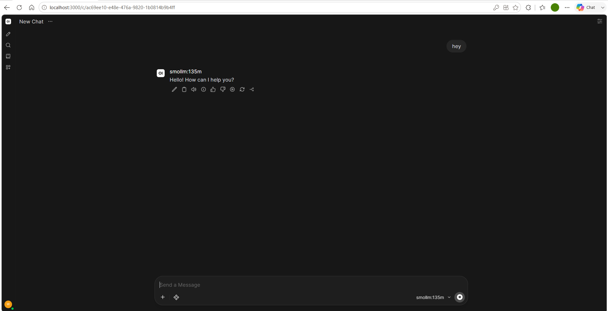
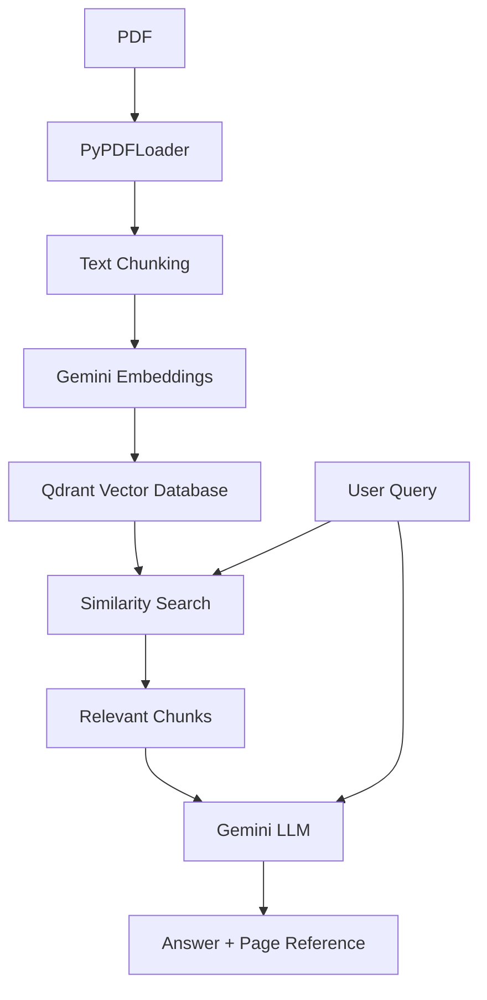

# Agentic AI Projects

A collection of projects and experiments I built while learning Generative AI, Agentic AI, Large Language Models (LLMs), RAG, and related concepts.

## Projects

### 1. GPT-4o Tokenizer

A simple Python program using `tiktoken` to encode text into GPT-4o
token IDs and decode the tokens back into text.

**Technologies:** Python, tiktoken

---

### 2. LLM API Integration

Python programs that interact with Large Language Models through APIs
and generate responses based on user input.

**APIs:** OpenAI API, Google Gemini API  
**Technologies:** Python, OpenAI SDK, Google GenAI SDK

---

### 3. Prompt Engineering

A collection of Python programs exploring different prompt engineering
techniques for controlling and improving LLM responses.

**Techniques explored:**
- System prompting
- One-shot prompting
- Few-shot prompting
- Chain-of-Thought (CoT) prompting
- Persona-based prompting

**Technologies:** Python, LLM APIs

---

### 4. Running an LLM Locally

Experimented with running **SmolLM 135M** locally using **Ollama** and
**Open WebUI**, allowing interaction with the model without relying
on a cloud-hosted LLM API.

**Technologies:** Ollama, Open WebUI, SmolLM 135M

---

### 5. FastAPI + Ollama

Built a **FastAPI application** that interacts with a locally running
LLM through **Ollama** and tested the API endpoints using **Swagger UI**.

**Technologies:** Python, FastAPI, Ollama

---

### 6. Multimodal LLM with Hugging Face

Used the **Hugging Face Transformers** library to run an open-source
multimodal model and generate a response from an image and text prompt.

The program uses an image-text input to identify the object in an image.

**Technologies:** Python, Hugging Face Transformers, Gemma

---

### 7. AI Agents

Built AI agents that can reason through tasks and interact with external
tools based on the user's request.

**Agents:**

- **Weather Agent** – Uses a weather API/tool to retrieve current weather
information for a requested city.
- **CLI Coding Agent** – Can execute system commands through a CLI tool to
assist with coding-related tasks.

The agent follows a structured workflow:

`START → PLAN → TOOL → OBSERVE → PLAN → OUTPUT`

The implementation uses structured JSON responses validated with Pydantic
to determine the next action and tool to execute.

**Technologies:** Python, Gemini API, OpenAI SDK, Pydantic, Requests,
Tool Calling

---

### 8. RAG PDF Chatbot

Built a Retrieval-Augmented Generation (RAG) chatbot that allows users
to ask questions about the contents of a PDF.

The application uses `PyPDFLoader` to load the document and
`RecursiveCharacterTextSplitter` to divide it into overlapping chunks.
The chunks are converted into vector embeddings using Gemini Embeddings
and stored in a local Qdrant vector database.

When a user submits a query, the application performs similarity search
to retrieve relevant document chunks and provides them as context to
the Gemini LLM. The response also includes the relevant PDF page number
to help the user locate the source information.

**Technologies:** Python, LangChain, Qdrant, Gemini Embeddings, Gemini API

#### Architecture

---

### 9. Asynchronous RAG API with FastAPI & RQ

Extended the RAG PDF chatbot into an asynchronous API using FastAPI
and a background job queue.

User queries are submitted through a FastAPI endpoint and added to an
RQ job queue. A worker processes the query in the background, performs
similarity search against the Qdrant vector database, and uses the
Gemini API to generate the final response.

The API provides endpoints to submit queries and retrieve the result
using the job ID.

**Architecture:**

`FastAPI → RQ Queue → Valkey → Worker → Qdrant → Gemini API`

**Technologies:** Python, FastAPI, Redis/RQ, Valkey, Qdrant,
LangChain, Gemini API

---

### 10. Multimodal AI Agent

Built a multimodal AI application using the Gemini API that accepts
both text and image inputs.

The application uploads an image and provides it to the model along
with a text instruction, allowing the model to analyze and describe
the image.

**Technologies:** Python, Gemini API, Google GenAI SDK, Multimodal LLMs

---

### 11. LangGraph Workflows & Memory

Built and experimented with LLM workflows using **LangGraph**, exploring
state management, graph-based execution, conditional routing, and
persistent conversation state.

**Experiments include:**

- Building a basic chatbot workflow using LangGraph nodes and edges.
- Managing conversation state using `TypedDict` and message reducers.
- Creating multi-node workflows with sequential execution.
- Implementing conditional routing based on LLM output evaluation.
- Adding persistent state using **MongoDB checkpointing** with
  `MongoDBSaver`.
- Using thread IDs to maintain state across graph executions.

**Technologies:** Python, LangGraph, LangChain, Gemini, MongoDB